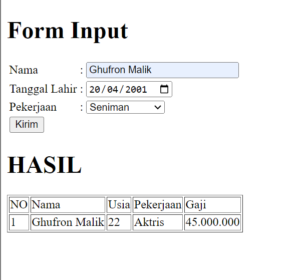

# Belajar PHP Dasar

Repositori ini berisi contoh-contoh sederhana untuk belajar dasar-dasar pemrograman PHP. Terdapat dua file utama:

1. `latihan.php`: File ini berisi latihan-latihan sederhana menggunakan PHP, seperti penggunaan variabel, form input, operator, kondisi, dan perulangan.
2. `tugas.php`: File ini merupakan tugas sederhana yang meminta pengguna untuk memasukkan nama, tanggal lahir, dan pekerjaan, kemudian menampilkan output berupa umur berdasarkan tanggal lahir dan gaji berdasarkan pekerjaan yang dipilih.

## Latihan PHP

### Form Input

- Membuat form input dengan HTML dan memprosesnya menggunakan PHP.
- Pengguna dapat memasukkan nama pada form, kemudian nama tersebut akan menghasilkan output seperti di gambar.

### Operator

- Contoh penggunaan operator dalam PHP, termasuk operator aritmatika dan operator penugasan.
- Demonstrasi penggunaan operator untuk menghitung gaji yang dibawa pulang setelah dipotong pajak.

### Kondisi (IF dan Switch)

- Contoh penggunaan struktur kondisi IF dan Switch dalam PHP.
- Menggunakan kondisi untuk menentukan hari berdasarkan hari saat ini.

### Perulangan (for, while, dan do-while)

- Contoh penggunaan perulangan for, while, dan do-while dalam PHP.
- Menampilkan perulangan angka 1 hingga 10 dan sebaliknya.

## Tugas PHP

Pada bagian `tugas.php`, saya membuat sebuah tugas yang melibatkan interaksi pengguna:

- **Form Input**: Saya membuat formulir di mana pengguna diminta untuk memasukkan nama, tanggal lahir, dan pekerjaan mereka. Saya kemudian memproses informasi ini untuk menghitung umur berdasarkan tanggal lahir dan menentukan gaji berdasarkan pekerjaan yang dipilih. Berikut tampilan dari hasil program yang telah dibuat.

### Form Input

- Meminta pengguna untuk memasukkan nama, tanggal lahir, dan pekerjaan melalui form.
- Data yang dimasukkan akan diproses untuk menghitung umur berdasarkan tanggal lahir dan menentukan gaji berdasarkan pekerjaan.
